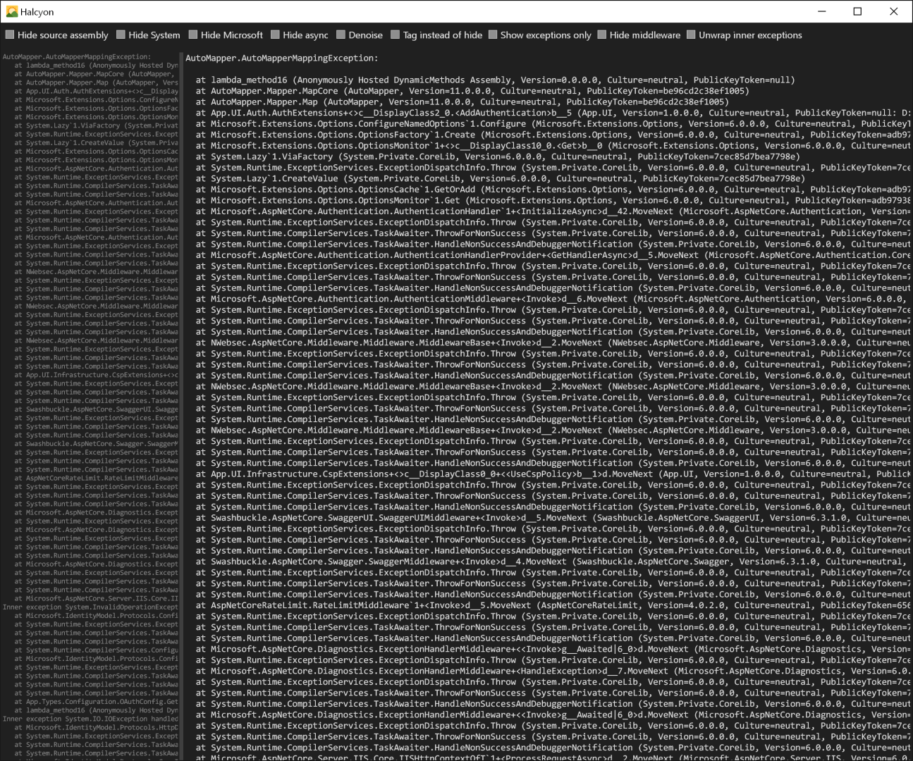
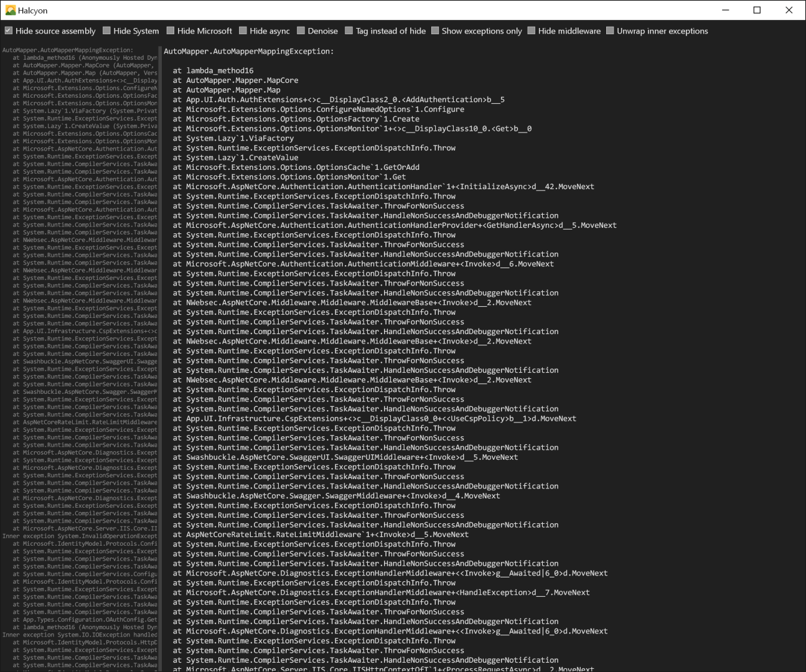
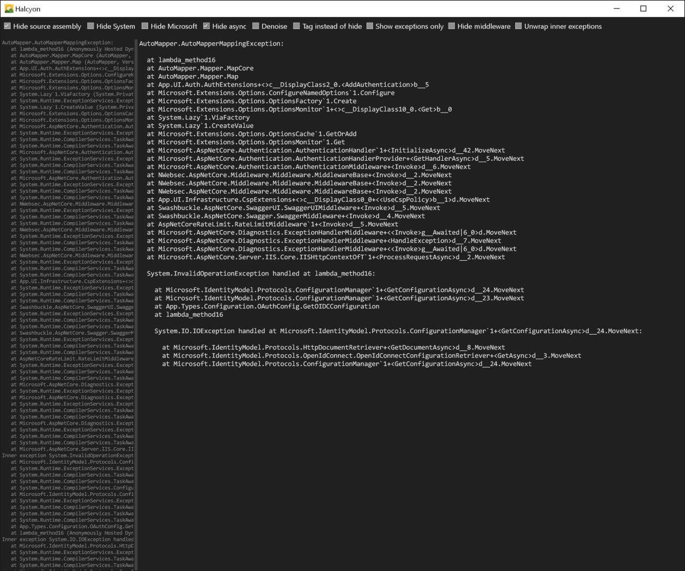
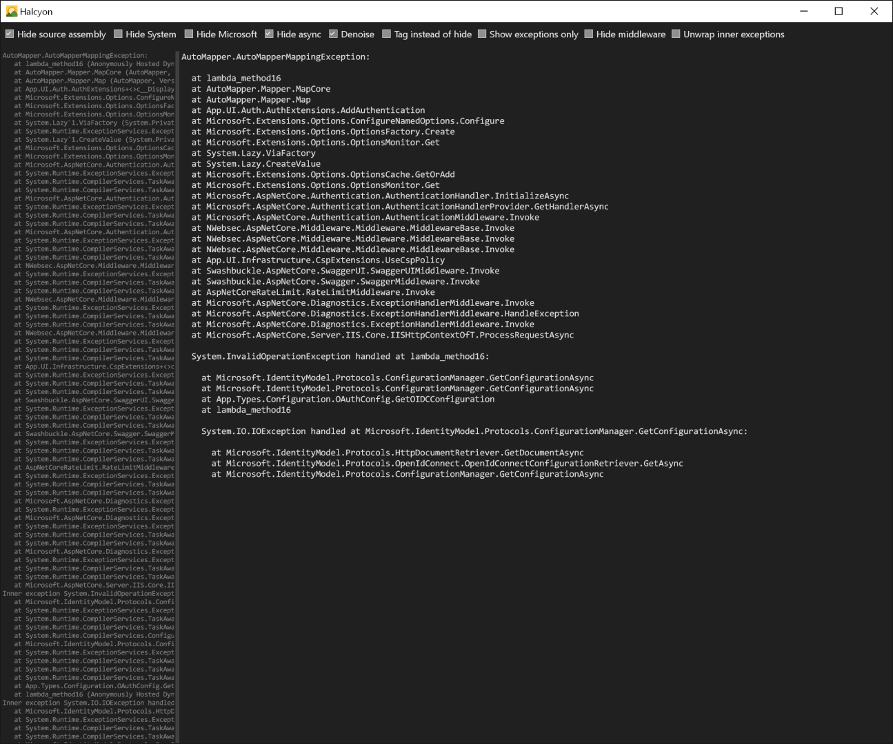
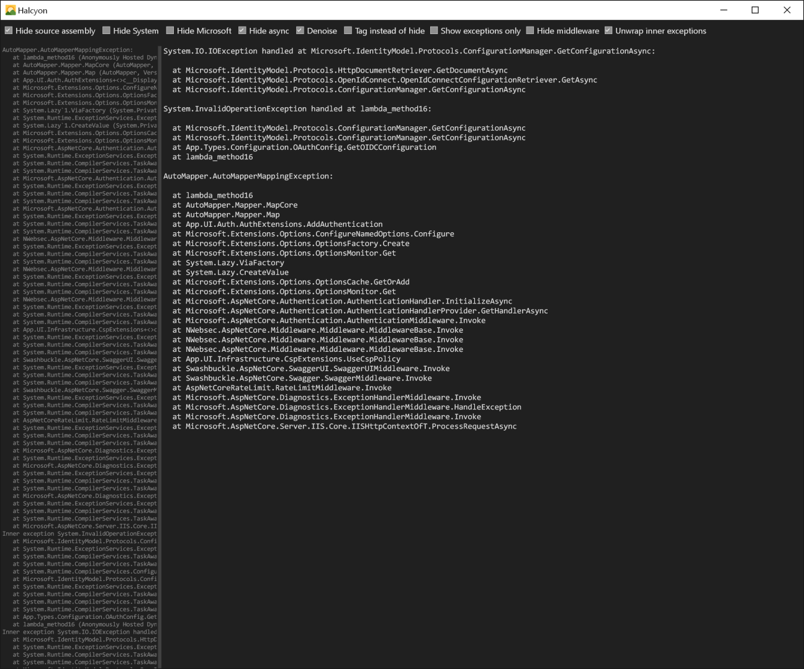

# Halcyon

Simplified view of dotnet exception stack trace

## Usage

Paste stack trace into the left panel and check wanted options.
Uses clipboard contents by default.

### Options
- Hide source assembly
- Hide calls to System.
- Hide calls to Microsoft.
- Hide async stack frames
- Hide generic/async/lambda/generator noise
- Tag frames instead of hiding them
- Show exceptions only, no frames
- Hide any stack with `*Middleware.` in the name
- Unwrap (reorder) inner exceptions

## Example

Source: [example/example.txt](example/example.txt)

Original

Hide assembly info

Hide async stacks

Denoise

Unrap inner exceptions
